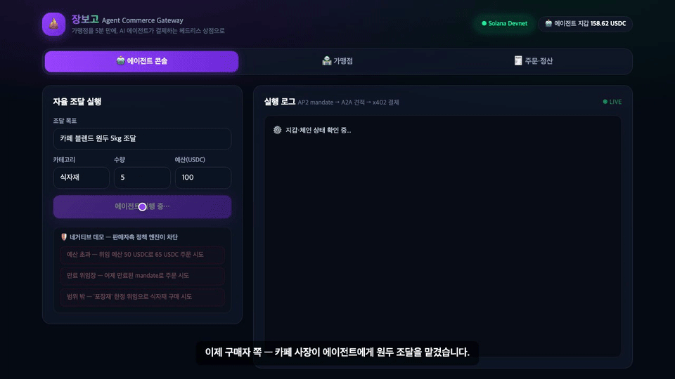
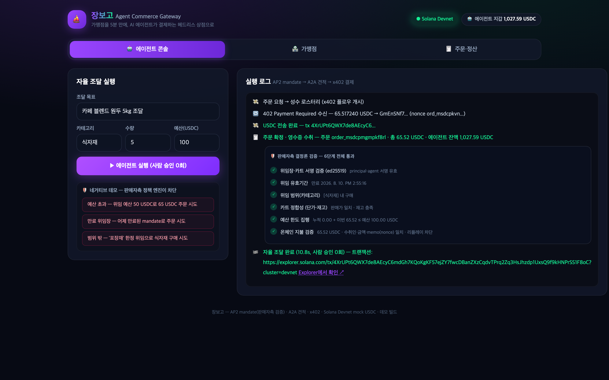
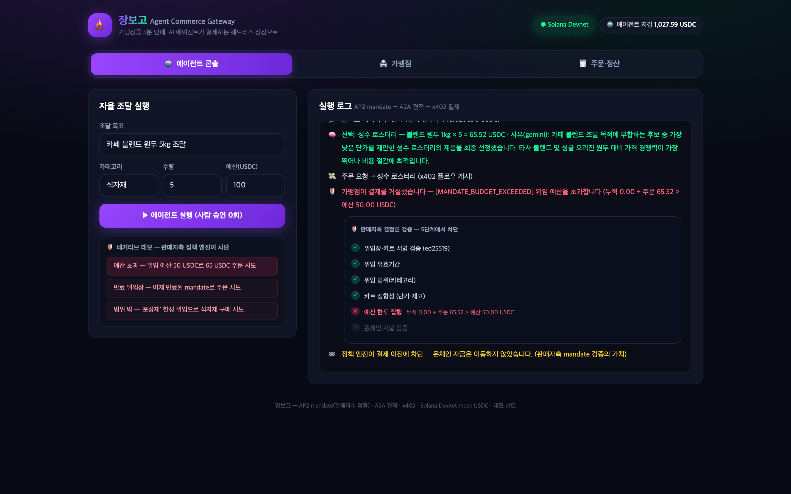
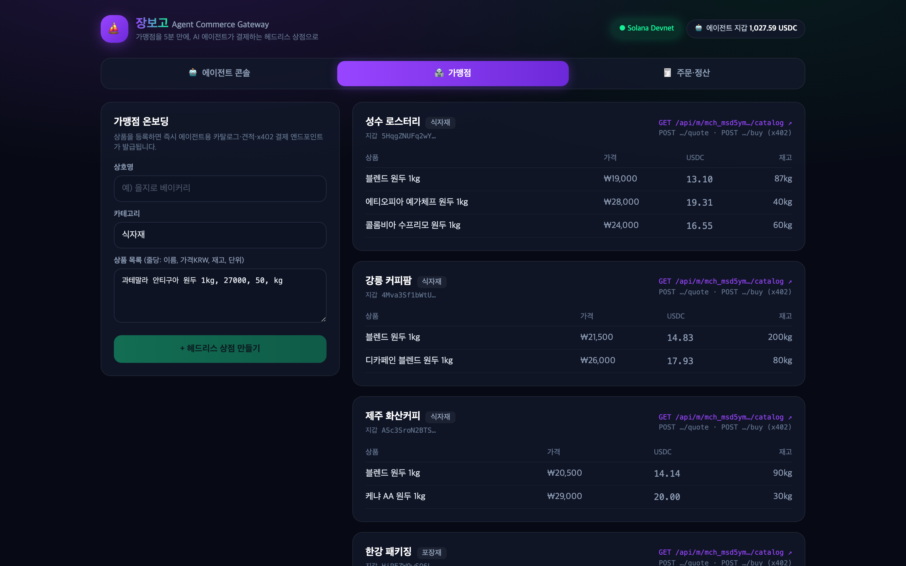
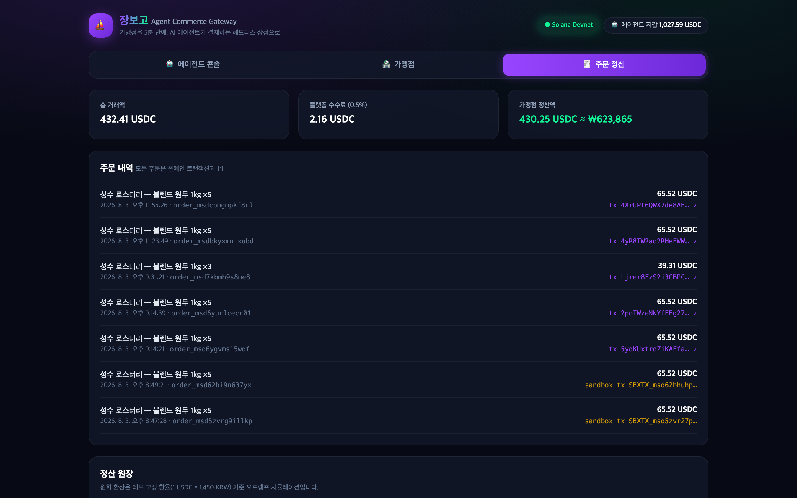
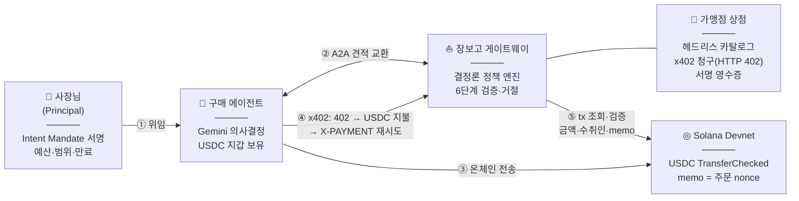
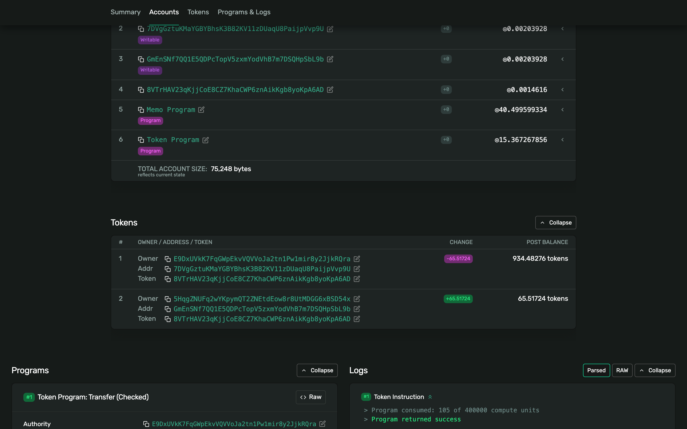
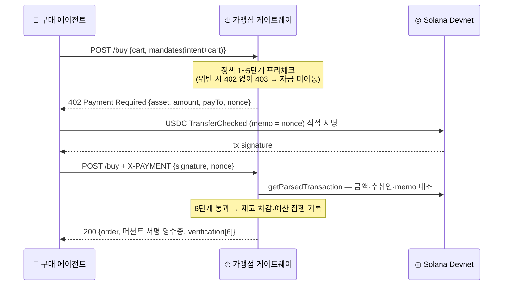

# ⛵ 장보고 (JangBogo) — Agent Commerce Gateway

> **"상품 목록만 붙여넣으면, 5분 만에 당신의 가게가 AI 에이전트에게 물건을 파는 헤드리스 상점이 됩니다."**

**Google x Solana AI Agentic Hackathon** 제출작 · Team **사공이(402)** · 트랙 B: Autonomous On-chain Settlement

| 제출물 | 링크 |
|---|---|
| 🌐 **라이브 데모** (심사 기간 상시 가동) | **https://jangbogo-748897460867.asia-northeast3.run.app** |
| 📽️ **데모 영상** (2:40) | **https://youtu.be/ALdVyGhXPT8** |
| 📊 프로젝트 소개서 (PDF 10장) | [`submission/장보고_소개서.pdf`](submission/장보고_소개서.pdf) |
| 🔍 온체인 증빙 (실제 devnet 트랜잭션) | [Solana Explorer — Finalized·memo=주문 nonce](https://explorer.solana.com/tx/5yqKUxtroZiKAFfavT6sLZwgb9BuFxdP881vgtTKBBPPbrjezxoGyMFL4wZyzYYRDvBzxBA7qZTJp21hTNSVFPEq?cluster=devnet) |
| 📚 설계·QA 문서 7종 | [`docs/00-CONTEXT.md`](docs/00-CONTEXT.md) ~ [`docs/06-QA-REPORT.md`](docs/06-QA-REPORT.md) |

---

## 한눈에 보기 — 자율 결제 + 판매자측 6단계 검증 (실시간)



> 에이전트가 견적을 비교해 온체인 결제를 마치는 순간, 가맹점의 결정론 정책 엔진이 서명→만료→범위→카트→예산→온체인 지불까지 6단계를 검증해 스텝퍼로 시각화한다. **사람 승인 0회.**

## 심사 기준 대응표

| 평가 기준 | 장보고의 대응 | 증빙 |
|---|---|---|
| **혁신성 / UX** | 경쟁작들이 구매자측 한도 지갑에 몰릴 때, 유일하게 **판매자측(가맹점 온보딩+검증)**을 공략. 코드 0줄 온보딩 + 검증 스텝퍼 시각화 | 위 GIF · [스크린샷](#스크린샷) |
| **AI 활용도** | Gemini가 견적 비교·선택 사유 생성 (Cloud Run: **Vertex AI** `gemini-3-flash-preview`, 서비스 계정 인증). 단, 결제 승인은 LLM 불개입 — 이것이 설계의 핵심 | [`src/lib/llm.ts`](src/lib/llm.ts) |
| **인프라 연동** | x402 스펙 준거 자체 구현 + Solana devnet USDC(SPL) 실전송 + AP2 준거 mandate + Cloud Run/Cloud Build | [`src/lib/x402.ts`](src/lib/x402.ts) · [`src/lib/chain.ts`](src/lib/chain.ts) |
| **실제 구동** | devnet 실트랜잭션(Explorer Finalized) · 라이브 URL 상시 가동 · 실행 로그 스트리밍 | [tx 증빙](https://explorer.solana.com/tx/5yqKUxtroZiKAFfavT6sLZwgb9BuFxdP881vgtTKBBPPbrjezxoGyMFL4wZyzYYRDvBzxBA7qZTJp21hTNSVFPEq?cluster=devnet) · [라이브](https://jangbogo-748897460867.asia-northeast3.run.app) |

## 정량 지표 (실측)

| 지표 | 값 |
|---|---|
| 자율 조달 풀사이클 (견적 비교→결제→서명 영수증) | **4.7 ~ 10.5초** (사람 승인 0회) |
| 온체인 확정 | Solana devnet ~400ms · 트랜잭션 수수료 ◎0.000005 |
| 테스트 | **단위 11 + 통합 20 = 31/31 통과** |
| 차단 검증된 공격/오류 | **5종** — 예산 초과 · 만료 위임장 · 범위 밖 · 과소지불 · 리플레이 |
| 애플리케이션 코드 | TypeScript 약 2,000줄 (프레임워크 보일러플레이트 제외) |
| 플랫폼 수수료 | 0.5% (자동 정산 원장 집계 구현) |

## 스크린샷

| 자율 구매 + 판매자측 6단계 검증 스텝퍼 | 네거티브: 예산 초과를 결제 전에 차단 |
|---|---|
|  |  |

| 가맹점 온보딩 (코드 0줄 → 엔드포인트 발급) | 주문·정산 (tx 1:1 연결 · 수수료 0.5% · 원화 환산) |
|---|---|
|  |  |

---

## 왜 장보고인가

- **에이전트 커머스의 병목은 판매자다.** x402·AP2가 표준화돼도, 국내 VAN 가맹점 33만 곳 중 에이전트의 자율 구매를 받을 수 있는 상점은 0곳이다. 카드 결제는 3DS 본인인증 루프에 사람이 필요해 에이전트는 구조적으로 결제할 수 없다.
- **자율 결제가 열리는 순간 가맹점의 질문은 "이 에이전트를 믿어도 되나"다.** 장보고는 가맹점이 직접 위임장(AP2 mandate)을 검증하고, 예산·범위·만료를 어기는 주문을 결제 전에 거절한다.
- **검증은 전부 결정론적 코드로.** 프롬프트 인젝션은 근본적으로 완전 방어가 불가능하므로(arXiv:2605.17634) 한도 집행은 LLM이 아닌 정책 엔진이 한다. LLM(Gemini)은 견적 비교 사유 서술에만 쓴다.

## 아키텍처



### 판매자측 결정론 검증 6단계 (신뢰 경계 — LLM 불개입)

| # | 단계 | 거절 코드 |
|---|---|---|
| 1 | 위임장·카트 **ed25519 서명** 검증 | `MANDATE_*_SIG_INVALID` |
| 2 | 위임 **유효기간** | `MANDATE_EXPIRED` |
| 3 | 위임 **범위(카테고리)** | `MANDATE_SCOPE_VIOLATION` |
| 4 | **카트 정합성** (단가·재고) | `CART_PRICE_MISMATCH` 등 |
| 5 | **누적 예산 한도** (mandate별 지출 추적) | `MANDATE_BUDGET_EXCEEDED` |
| 6 | **온체인 지불 일치** (금액·수취인·memo=nonce·리플레이) | `PAYMENT_*` |

1~5는 **결제가 일어나기 전**에, 6은 온체인 검증 단계에서 거절된다. 전 과정이 UI 스텝퍼로 시각화된다.

## 실제 구동 증빙 — 온체인에 이렇게 기록된다

영상 속 결제의 실제 devnet 트랜잭션. **TransferChecked 65.51724 USDC + Memo에 주문 nonce**가 박혀 주문↔결제가 1:1로 묶인다:



### x402 결제 플로우 (시퀀스)



라이브 서비스의 **실제 402 응답** (2026-08-04 캡처):

```json
{
  "x402Version": 1,
  "error": "payment_required",
  "accepts": [{
    "scheme": "exact",
    "network": "solana-devnet",
    "asset": "8VTrHAV23qKjjCoE8CZ7KhaCWP6znAikKgb8yoKpA6AD",
    "amount": "13.103448",
    "payTo": "GmEnSNf7QQ1E5QDPcTopV5zxmYodVhB7m7DSQHpSbL9b",
    "nonce": "ord_msdd4t0evq2o4f",
    "memo": "ord_msdd4t0evq2o4f",
    "expiresInSec": 300
  }]
}
```

## 빠른 시작 (로컬 재현)

```bash
git clone https://github.com/jang961111-hash/jangbogo.git
cd jangbogo
npm install
npm run dev        # → http://localhost:3402
```

첫 접속 시 자동 부트스트랩: 키 생성 → devnet airdrop 시도 → **mock USDC 발행(운영진 권장 방식)** → 데모 가맹점 시딩.
devnet faucet 한도(429) 시 **sandbox 모드로 자동 폴백**(동일 코드 경로, UI에 배지 표시)되며, payer 지갑에 devnet SOL을 넣으면 자동 복귀한다 — 상세: [`docs/05-DEPLOY.md`](docs/05-DEPLOY.md)

```bash
npm test                  # 단위 11 케이스 (서명 위조·만료·범위·예산 경계값 등)
npm run test:integration  # 통합 20 케이스 (풀사이클 + 공격 시나리오, 서버 기동 상태에서)
```

선택 환경변수 (`.env.local`): `GEMINI_API_KEY`(없으면 결정론 폴백), `SOLANA_RPC_URL`, `VERTEX_PROJECT`(Cloud Run용)

### 데모 시나리오 (3분)

1. **에이전트 콘솔** → `▶ 에이전트 실행` — mandate 발급 → 가맹점 견적 비교 → Gemini 사유 → x402 결제 → 서명 영수증까지 **사람 승인 0회, 5~10초**
2. **네거티브 버튼 3종** — 예산 초과·만료·범위 밖이 **결제 이전에** 차단되는 것을 스텝퍼로 확인 (자금 미이동)
3. **주문·정산 탭** — tx 해시 클릭 → Solana Explorer에서 Finalized·memo 확인
4. **가맹점 탭** — 새 가게를 직접 온보딩해 즉시 엔드포인트 발급

## API (헤드리스 머천트 엔드포인트)

| Method | Path | 설명 |
|---|---|---|
| `GET` | `/api/m/{id}/catalog` | 기계용 상품 카탈로그 (JSON) |
| `POST` | `/api/m/{id}/quote` | A2A 메시지 구조 견적 교환 (buyer-agent ↔ merchant-agent) |
| `POST` | `/api/m/{id}/buy` | **x402 플로우**: 1차 → `402 PaymentRequirements`(nonce) / 2차 `X-PAYMENT` → 온체인 검증 → 주문 확정 + 머천트 서명 영수증 |
| `POST` | `/api/merchants` | 가맹점 온보딩 (즉시 엔드포인트 발급) |
| `POST` | `/api/agent/run` | 자율 구매 에이전트 실행 (SSE 로그 스트림) |
| `GET` | `/api/state` | 대시보드 상태 스냅샷 |

전체 스펙: [`docs/03-API-SPEC.md`](docs/03-API-SPEC.md)

## 기술 스택

**AI·Google Cloud** — Gemini(Cloud Run: Vertex AI `gemini-3-flash-preview` / 로컬: AI Studio API, 폴백 체인: Vertex → API 키 → 결정론) · Cloud Run + Cloud Build (asia-northeast3)
**Blockchain** — Solana Devnet(@solana/web3.js, SPL Token, mock USDC 자체 발행) · x402 스펙 준거 자체 구현 · AP2 준거 Intent/Cart Mandate(ed25519·tweetnacl) · A2A 메시지 구조
**App·품질** — Next.js 15(TypeScript) · Tailwind CSS · vitest(단위 11+통합 20) · Playwright(데모 영상 자동 촬영)

## 팀 — 사공이(402)

> "402"는 이 해커톤의 심장인 HTTP **402** Payment Required, 한국어로 읽으면 뱃**사공** — 장보고(해상 무역왕) 세계관의 노를 젓는 사람들.

| 이름 | 역할 |
|---|---|
| **장병헌** | 팀장 · PM/풀스택 — 에이전트 설계 · 프론트엔드 · GCP 인프라 |
| **김지원** | 백엔드 — 온체인 결제 · AP2/x402 검증 엔진 · QA |

## 정직 고지 (데모 범위와 한계)

- devnet 데모이며 원화 정산은 고정 환율(1 USDC=1,450 KRW) 시뮬레이션이다. pay.sh는 호환 설계만 반영(실연동 아님), AP2/A2A는 스펙 구조 준거 축약 구현이다.
- **키 관리**: 데모에서는 원클릭 시연을 위해 principal(사장)·에이전트 키를 서버가 생성·보관한다. 실서비스 설계는 사장 지갑(Phantom 등)이 Intent Mandate를 직접 서명하고 에이전트 키는 비수탁 지갑으로 분리하는 것이며, 검증 로직([`policy.ts`](src/lib/policy.ts))은 키 보관 위치와 무관하게 동일하게 동작한다.
- **상태 저장**: 데모는 파일 DB(인스턴스 생명주기 동안 유지)를 쓴다. 인스턴스가 재시작해도 리플레이 공격은 뚫리지 않는다 — 결제는 온체인 memo가 **매 주문의 신규 nonce**와 일치해야 하므로, 과거 서명은 어떤 새 주문과도 매칭되지 않는다 (2차 방어: 서명 재사용 차단 목록). 프로덕션 전환 시 Firestore 교체 경로는 [`docs/05-DEPLOY.md`](docs/05-DEPLOY.md) 참조.
- 개발 중 에이전트가 "원두 조달" 지시에 방금 온보딩된 최저가 베이글을 사 온 사고가 있었고, 그 사건으로 견적 매칭·범위 검증을 재설계했다 — 네거티브 테스트 7종은 그렇게 나왔다.

## 수익모델

거래 수수료 **0.5%** (카드 대비 1/3~1/6) + 정산 SaaS(월 29,000원) + 온체인 매출 이력 기반 **선정산(팩토링)** 확장 — 상세는 [소개서](submission/장보고_소개서.pdf) 참조.
